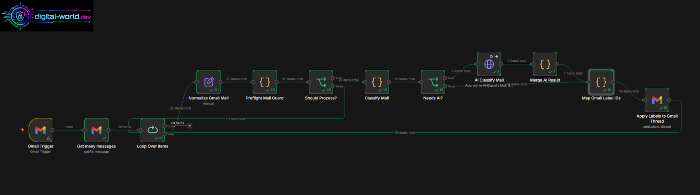

# Gmail AI Auto Labeling for n8n

Ein n8n-Workflow, der Gmail-Mails automatisch klassifiziert, passende Gmail-Labels setzt und nur bei unsicheren Fällen eine KI-Klassifizierung über OpenRouter nutzt.



## Was macht der Workflow?

Der Workflow verarbeitet regelmäßig Gmail-Mails aus dem Posteingang, normalisiert die wichtigsten Felder, prüft auf bereits verarbeitete Mails, klassifiziert regelbasiert und nutzt KI nur als Fallback.

```text
Gmail Trigger
→ Get many messages
→ Loop Over Items
→ Normalize Gmail Mail
→ Preflight Mail Guard
→ Should Process?
   ├─ false → nächste Mail
   └─ true  → Classify Mail
              → Needs AI?
                 ├─ true  → AI Classify Mail → Merge AI Result
                 └─ false → direkt weiter
              → Map Gmail Label IDs
              → Apply Labels to Gmail Thread
              → nächste Mail
```

## Gedacht für

- private Gmail-Postfächer
- Admins, Selbstständige, Creator und Power-User
- automatische Vorsortierung von Rechnungen, Server-Mails, Bank-Mails, Jobangeboten, KI-Tools, Social-Media-Mails und wichtigen Nachrichten
- Review-Workflow, bei dem unsichere Mails nicht gelöscht, sondern mit `AUTO/Review` markiert werden

## Sicherheitsprinzip

Der Workflow löscht nichts, archiviert nichts und markiert nichts als gelesen. Er setzt nur Labels. Dadurch ist er am Anfang bewusst konservativ.

## Wichtige Labels

Beispiele:

```text
AUTO/Amazon
AUTO/Amazon KDP
AUTO/Bank/Haspa
AUTO/PayPal
AUTO/Server/Hetzner
AUTO/Security/CrowdSec
AUTO/KI/OpenAI
AUTO/KI/OpenRouter
AUTO/Social/YouTube
AUTO/Review
AUTO/Fehler
AUTO/Wichtig
```

`AUTO/Wichtig` sollte in Gmail manuell rot eingefärbt werden, damit kritische Mails sofort auffallen.

## Voraussetzungen

- n8n Cloud oder self-hosted n8n
- Gmail OAuth2 Credential in n8n
- OpenRouter Account mit API-Key
- bereits angelegte Gmail-Labels oder Anpassung der Label-ID-Zuordnung im Workflow

## Installation

1. Datei `workflows/gmail-ai-auto-labeling.public.json` herunterladen.
2. In n8n öffnen.
3. Workflow importieren:
   - n8n Editor öffnen
   - Menü oben rechts öffnen
   - `Import from File`
   - JSON-Datei auswählen
4. Gmail Credential in folgenden Nodes setzen:
   - `Gmail Trigger`
   - `Get many messages`
   - `Apply Labels to Gmail Thread`
5. OpenRouter Credential in `AI Classify Mail` setzen:
   - Auth-Typ: Bearer Auth
   - Token: dein OpenRouter API-Key
6. Labels in Gmail anlegen.
7. In `Map Gmail Label IDs` die Label-IDs an dein Gmail-Konto anpassen.
8. Testlauf mit wenigen Mails durchführen.
9. Erst nach erfolgreichem Test aktivieren.

## Was muss angepasst werden?

### 1. Gmail Credentials

Nach dem Import sind Credentials aus Sicherheitsgründen nicht enthalten. Du musst deine eigenen n8n-Credentials setzen.

### 2. OpenRouter Key

In der Node `AI Classify Mail` brauchst du ein Bearer Credential:

```text
Bearer <DEIN_OPENROUTER_API_KEY>
```

Im Workflow wird standardmäßig ein günstiges Modell genutzt:

```text
openai/gpt-4o-mini
```

Du kannst das Modell im JSON-Body der HTTP-Request-Node ändern.

### 3. Gmail Label IDs

Gmail-Labels haben kontoabhängige IDs wie:

```text
Label_118
Label_120
```

Die Namen sind übertragbar, die IDs nicht. Deshalb muss die Node `Map Gmail Label IDs` angepasst werden.

Beispiel:

```javascript
const LABEL_ID_MAP = {
  "AUTO/Review": "Label_118",
  "AUTO/Wichtig": "Label_120"
};
```

### 4. Klassifizierungsregeln

Die Hauptlogik liegt in der Code-Node:

```text
Classify Mail
```

Dort kannst du neue Regeln ergänzen:

```javascript
{
  group: "server",
  label: "AUTO/Server/Hetzner",
  domains: ["hetzner.com"],
  keywords: ["hetzner", "server", "rechnung", "invoice"],
  minScore: 70,
  trusted: true
}
```

### 5. KI-Fallback-Prompt

Die KI wird nur genutzt, wenn `needs_ai = true` ist. Passe in der Node `AI Classify Mail` die erlaubten Labels an, wenn du neue Labels ergänzt.

## Datenschutz

Der Workflow sendet standardmäßig nur Metadaten an OpenRouter:

- Absender
- Absenderdomain
- Betreff
- Snippet
- Anhangsnamen
- bisherige Regel-Labels

Der komplette Mailtext wird nicht gesendet.

## Bekannte Grenzen

- Gmail-Label-IDs sind nicht portabel.
- Neue Labelnamen müssen in mehreren Stellen gepflegt werden:
  - Gmail selbst
  - `Map Gmail Label IDs`
  - `Classify Mail`
  - optional: `AI Classify Mail`
  - optional: `Merge AI Result`
- KI-Klassifizierung ist nur ein Fallback und kann falsch liegen.
- Für produktiven Betrieb erst mehrere Tage nur labeln und prüfen.

## Empfohlener Test

1. Workflow manuell starten.
2. Nur 5 bis 20 Mails verarbeiten lassen.
3. Prüfen:
   - Werden Bank-/Server-/PayPal-Mails korrekt erkannt?
   - Landen unbekannte Newsletter in `AUTO/Review`?
   - Wird `AUTO/Wichtig` bei Anwalt/Polizei/Bank/Arzt gesetzt?
4. Danach aktivieren.

## Repository-Struktur

```text
.
├── README.md
├── SKOOL_POST.md
├── LICENSE
├── .gitignore
├── workflows/
│   └── gmail-ai-auto-labeling.public.json
└── docs/
    ├── INSTALLATION.md
    ├── CUSTOMIZATION.md
    ├── SECURITY.md
    └── images/
        └── workflow-overview.png
```

## Lizenz

MIT License. Nutzung auf eigene Verantwortung.
